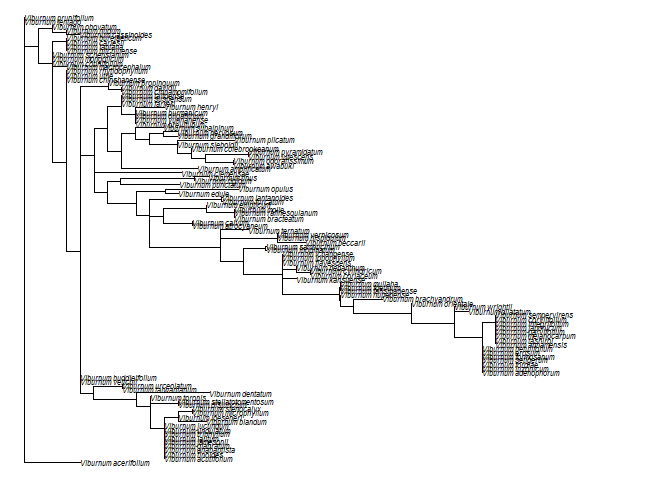

## Maximum Likelihood

Maximum likelihood tree for subset of Viburnum taxa constructed using chloroplast sequence data from NCBI and IQTree:


```r
# read in the phylogeny generated by IQtree 
phy = read.tree("rbcL_aligned.fasta.treefile")
# root the tree; need to follow up to understand what this function is doing
#phy=multi2di(phy)

#root the phylogeny with V. clemensae, sister to rest of genus
root(phy, phy[[4]][72])
```

```
## 
## Phylogenetic tree with 110 tips and 109 internal nodes.
## 
## Tip labels:
##   Viburnum_acerifolium, Viburnum_acutifolium, Viburnum_tinoides, Viburnum_anabaptista, Viburnum_glabratum, Viburnum_jamesonii, ...
## 
## Rooted; includes branch lengths.
```

```r
#View the phylogeny
plot(phy, no.margin=TRUE,edge.width=1, cex = 0.5)
```

<!-- -->

```r
# calibrate phylogeny (relative to root = 1)
phy_calibration <- makeChronosCalib(phy, node = "root", age.min = 1, age.max =
1, interactive = FALSE, soft.bounds = FALSE)

#make the phylogeny ultrameric using relative calibration
phy_ultrameric <- chronos(phy, lambda = 1, model = "relaxed", calibration = phy_calibration, control = chronos.control() )
```

```
## 
## Setting initial dates...
## Fitting in progress... get a first set of estimates
##          (Penalised) log-lik = -49.9894 
## Optimising rates... dates... -49.9894 
## Optimising rates... dates... -49.97825
```

```
## Warning: false convergence (8)
```

```
## 
## log-Lik = -0.9570368 
## PHIIC = 654.62
```

```r
#View the ultrameric phylogeny
plot(phy_ultrameric, no.margin=TRUE,edge.width=1, cex = 0.5)
```

<!-- -->


## Mapping Character Data onto the Tree

Visualization of the character 'palisade.type' mapped onto the tree tips. 


