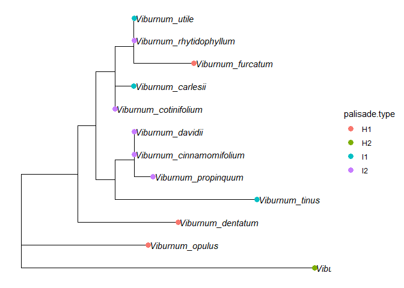
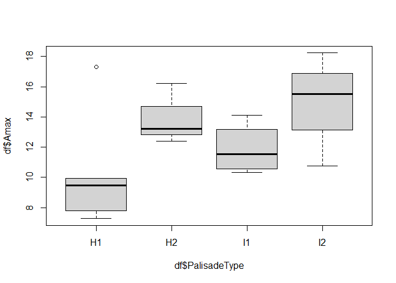

Minimum Viable Analysis
================
Aleca Borsuk
11/2/2020

## Maximum Likelihood

Maximum likelihood tree for subset of Viburnum taxa constructed using
chloroplast sequence data from NCBI and IQTree:

``` r
# read in the phylogeny generated by IQtree 
phy = read.tree("viburnum_alignment.fasta.treefile")
# root the tree; need to follow up to understand what this function is doing
phy=multi2di(phy)
#View the phylogeny
plot(phy)
```

<!-- -->

## Mapping Character Data onto the Tree

Visualization of the character ‘palisade.type’ mapped onto the tree
tips.

``` r
# View species names
species.names <- phy[[4]]
species.names
```

    ##  [1] "Viburnum_opulus"          "Viburnum_cotinifolium"   
    ##  [3] "Viburnum_carlesii"        "Viburnum_rhytidophyllum" 
    ##  [5] "Viburnum_utile"           "Viburnum_furcatum"       
    ##  [7] "Viburnum_cinnamomifolium" "Viburnum_davidii"        
    ##  [9] "Viburnum_propinquum"      "Viburnum_tinus"          
    ## [11] "Viburnum_dentatum"        "Viburnum_japonicum"

``` r
# Assign to data frame
D = data.frame(species = phy[[4]],
               palisade.type = c("H1", "I2", "I1","I2", "I1", "H1", "I2", "I2", "I2", "I1", "H1", "H2"))

# View data in table format
kable(D)
```

| species                   | palisade.type |
| :------------------------ | :------------ |
| Viburnum\_opulus          | H1            |
| Viburnum\_cotinifolium    | I2            |
| Viburnum\_carlesii        | I1            |
| Viburnum\_rhytidophyllum  | I2            |
| Viburnum\_utile           | I1            |
| Viburnum\_furcatum        | H1            |
| Viburnum\_cinnamomifolium | I2            |
| Viburnum\_davidii         | I2            |
| Viburnum\_propinquum      | I2            |
| Viburnum\_tinus           | I1            |
| Viburnum\_dentatum        | H1            |
| Viburnum\_japonicum       | H2            |

``` r
# Plot
palisade.type_plot = ggtree(phy) %<+% D + 
  geom_tiplab( fontface = "italic") +
  #xlim(0, 300) +
  geom_tippoint( aes(color=palisade.type), size=3, alpha=1 )

palisade.type_plot
```

<!-- -->

```` 


## Phylogenetically Informed ANOVA

Here using the tree from the above analysis to do a test run of a phylogenetically informed ANOVA. ANOVA method conducted using geiger v2.0 (Pennell et al. 2014):


```r
# import trait data
df <- read.csv("PalisadeTraits.csv", header = TRUE)
# format discrete data as factor
df$PalisadeType <- as.factor(df$PalisadeType)
# anova function takes named vectors as input
df1= df[,2]
df2 = df[,3]
names(df1)=df[,1]
names(df2)=df[,1]

# run ANOVA
x1=aov.phylo(df2~df1, phy, nsim=50)
````

    ## Warning in treedata(phy, yy, sort = TRUE): The following tips were not found in 'data' and were dropped from 'phy':
    ##  Viburnum_cotinifolium
    ##  Viburnum_rhytidophyllum

    ## Warning in treedata(phy, yy, sort = TRUE): The following tips were not found in 'phy' and were dropped from 'data':
    ##  Viburnum_hartwegii
    ##  Viburnum_jucundum
    ##  Viburnum_lantana
    ##  Viburnum_lautum
    ##  Viburnum_trilobum

    ## Analysis of Variance Table
    ## 
    ## Response: dat
    ##           Df Sum-Sq Mean-Sq F-value   Pr(>F) Pr(>F) given phy
    ## group      3 84.510 28.1699   4.886 0.047372           0.3725
    ## Residuals  6 34.593  5.7655

``` r
#print(attributes(x1)$summary) # summary table

# boxplot visualization
plot(df$Amax~df$PalisadeType)
```

<!-- --> Currently working
with a subset of the full dataset, so getting some errors related to
missing taxa, which is fine for now. I believe the ANOVA test shows that
there is a strong phylogenetic signal for maximum photosynthetic rate
(Amax), but that it is not related to palisade cell type. Just testing
the method on secondary data; will for the final project have updated
trait data, including more traits, to analyze.
