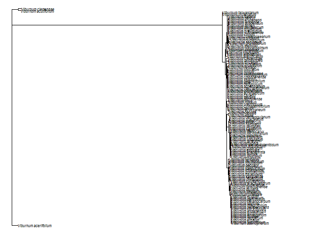
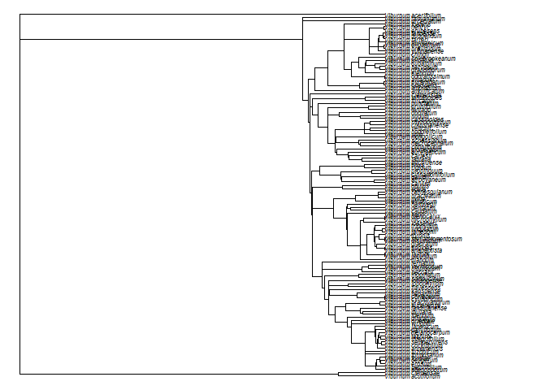
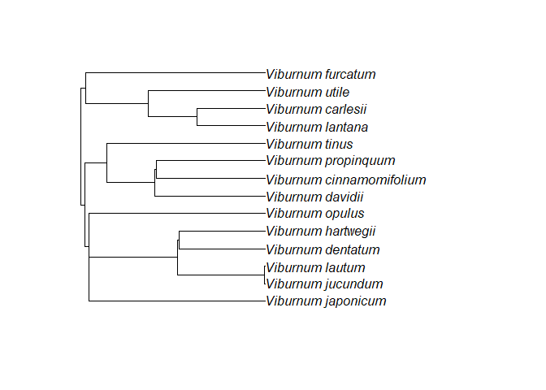
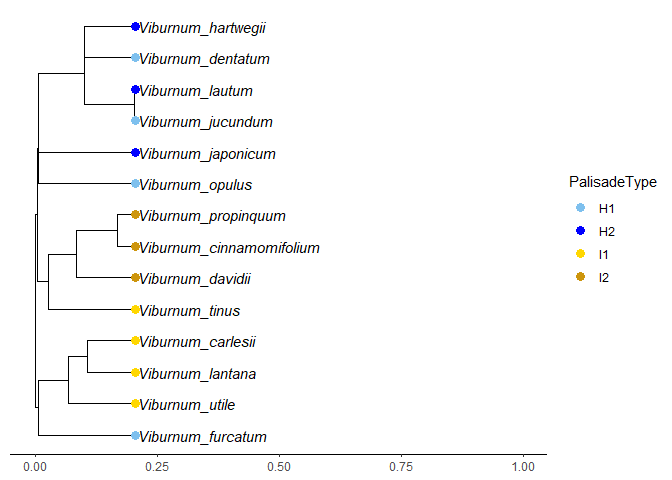
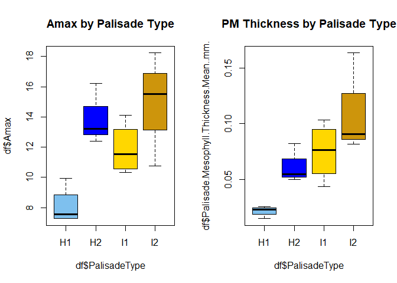
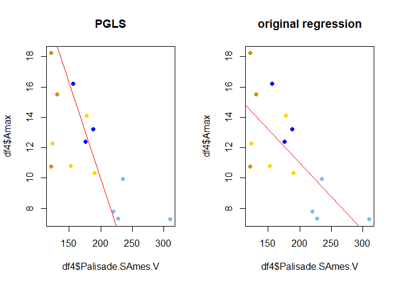
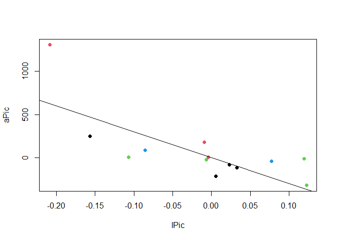
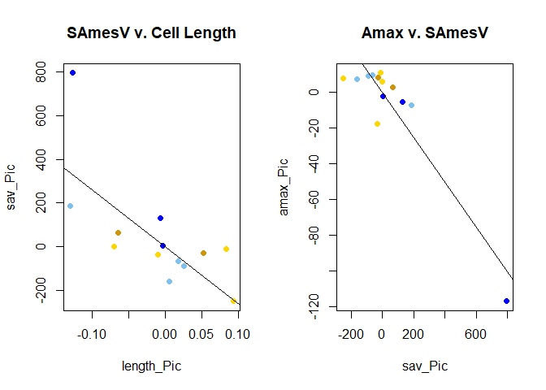

A phylogenetic approach to palisade cell functional trait analysis in
Viburnum
================
Aleca Borsuk
11/30/2020

## Maximum Likelihood

Maximum likelihood tree for subset of Viburnum taxa constructed using
chloroplast sequence data from NCBI and IQTree:

``` r
# read in the phylogeny generated by IQtree 
phy = read.tree("concatenated.fasta.treefile")

# resolve multichotomies into a series of dichotomies with one (or more) branches of length zero
phy=multi2di(phy)

#root the phylogeny with V. clemensiae, sister to rest of genus
root(phy, phy[[4]][94])
```

    ## 
    ## Phylogenetic tree with 119 tips and 118 internal nodes.
    ## 
    ## Tip labels:
    ##   Viburnum_acerifolium, Viburnum_acutifolium, Viburnum_clemensae, Viburnum_adenophorum, Viburnum_betulifolium, Viburnum_erosum, ...
    ## 
    ## Rooted; includes branch lengths.

``` r
#check if rooted
is.rooted(phy) 
```

    ## [1] TRUE

``` r
#View the phylogeny
plot(phy, no.margin=TRUE,edge.width=1, cex = 0.5)
```

<!-- -->

``` r
# Make ultrameric phylogeny (relative to root depth = 1)
phy_calibration <- makeChronosCalib(phy, node = "root", age.min = 1, age.max =
1, interactive = FALSE, soft.bounds = FALSE)

#make the phylogeny ultrameric using relative calibration
phy_ultrameric <- chronos(phy, lambda = 1, model = "correlated", calibration = phy_calibration, control = chronos.control() )
```

    ## 
    ## Setting initial dates...
    ## Fitting in progress... get a first set of estimates
    ##          (Penalised) log-lik = -36.62117 
    ## Optimising rates... dates... -36.62117 
    ## Optimising rates... dates... -4.714599 
    ## Optimising rates... dates... -2.669157 
    ## Optimising rates... dates... -2.252272 
    ## Optimising rates... dates... -2.044602 
    ## Optimising rates... dates... -2.027635

    ## Warning: false convergence (8)

    ## 
    ## log-Lik = -1.915301 
    ## PHIIC = 709.94

``` r
class( phy_ultrameric ) = "phylo"

#View the ultrameric phylogeny
plot(phy_ultrameric, no.margin=TRUE,edge.width=1, cex = 0.5)
```

<!-- --> \#\#
Pruning the Tree to Species of Interest

``` r
# Read in species names of interest for comparative analysis. This is also the table with trait data
# Trait data is a combination of measured and dummy data (study in progress)
df <- read.csv("PalisadeTraits.csv", header = TRUE)

# Remove the species of interest from the list of species to drop, then drop tips
sp_keep <- df$Species
sp_full <- phy[[4]]
to.drop <- sp_full [! sp_full %in% sp_keep]

phy_reduced = drop.tip( phy_ultrameric, to.drop )

plot( phy_reduced )
```

<!-- -->

## Mapping Character Data onto the Tree

Visualization of the character ‘palisade.type’ mapped onto the tree
tips.

``` r
# View data in table format
kable(df)
```

| Species                   | PalisadeType |      Amax | Native.Habitat  | Leaf.Thickness.Mean..mm. | Palisade.SAmes.V | Palisade.Mesophyll.Thickness.Mean..mm. | Palisade.Length.Mean..mm. | Palisade.Cell.Packing.Density….mm2. | Stomatal.Density….mm2. |
| :------------------------ | :----------- | --------: | :-------------- | -----------------------: | ---------------: | -------------------------------------: | ------------------------: | ----------------------------------: | ---------------------: |
| Viburnum\_jucundum        | H1           |  7.313572 | cloud\_forest   |                 0.120570 |         228.0162 |                                0.02275 |                   0.02275 |                            1520.087 |              134.91863 |
| Viburnum\_dentatum        | H1           |  9.931000 | cold\_temperate |                 0.120000 |         235.7622 |                                0.02564 |                   0.02564 |                            1857.143 |               98.76543 |
| Viburnum\_furcatum        | H1           |  7.265848 | cold\_temperate |                 0.090370 |         310.8701 |                                0.01475 |                   0.01475 |                            1973.387 |              171.64782 |
| Viburnum\_opulus          | H1           |  7.772967 | cold\_temperate |                 0.102160 |         220.3936 |                                0.02338 |                   0.02338 |                            1369.464 |              103.80623 |
| Viburnum\_hartwegii       | H2           | 12.391639 | cloud\_forest   |                 0.157000 |         176.3421 |                                0.05434 |                   0.02878 |                             945.520 |               95.74468 |
| Viburnum\_lautum          | H2           | 13.222929 | cloud\_forest   |                 0.170090 |         187.9587 |                                0.04976 |                   0.02914 |                            1314.245 |              102.93008 |
| Viburnum\_japonicum       | H2           | 16.201844 | warm\_temperate |                 0.267772 |         156.0678 |                                0.08221 |                   0.04117 |                            2967.359 |              503.16860 |
| Viburnum\_carlesii        | I1           | 10.325898 | cold\_temperate |                 0.187990 |         189.9813 |                                0.04360 |                   0.04360 |                            3518.030 |              126.95312 |
| Viburnum\_lantana         | I1           | 14.099067 | cold\_temperate |                 0.178980 |         177.6062 |                                0.06651 |                   0.06651 |                            4423.963 |              163.73921 |
| Viburnum\_tinus           | I1           | 12.258578 | cold\_temperate |                 0.317000 |         123.0385 |                                0.10339 |                   0.10339 |                            2693.089 |              155.55556 |
| Viburnum\_utile           | I1           | 10.777627 | cold\_temperate |                 0.241000 |         152.6536 |                                0.08579 |                   0.08579 |                            4928.989 |              255.00000 |
| Viburnum\_cinnamomifolium | I2           | 10.763419 | warm\_temperate |                 0.228000 |         121.5397 |                                0.09027 |                   0.04646 |                            2422.145 |              437.50000 |
| Viburnum\_davidii         | I2           | 18.228239 | warm\_temperate |                 0.364060 |         121.5932 |                                0.16325 |                   0.08694 |                            2416.626 |              423.13117 |
| Viburnum\_propinquum      | I2           | 15.506569 | warm\_temperate |                 0.227020 |         130.6503 |                                0.08139 |                   0.04905 |                            2421.652 |              279.22561 |

``` r
# Plot tree with tip labels by palisade type
cols <- c("skyblue2","blue","gold","darkgoldenrod3")

palisade.type_plot = ggtree(phy_reduced) %<+% df + 
  geom_tiplab( fontface = "italic", offset = 0.005) +
  scale_color_manual(values=cols) + 
  xlim(0, 1) +
  theme_tree2(legend.position='right')+
  geom_tippoint( aes(color=PalisadeType), size=3, alpha=1 )

palisade.type_plot
```

<!-- -->

## Phylogenetically Informed ANOVA

Here using the tree from the above analysis to do a test run of a
phylogenetically informed ANOVA. ANOVA method conducted using geiger
v2.0 (Pennell et al. 2014):

``` r
# Data formatting
# format discrete data as factor
df$PalisadeType <- as.factor(df$PalisadeType)

# ANOVA with palisade type as predictor of max photosynthetic rate
# anova function takes named vectors as input
df1= df[,2]
df2 = df[,3]
names(df1)=df[,1]
names(df2)=df[,1]
# run ANOVA 
x1=aov.phylo(df2~df1, phy_reduced, nsim=1000)
```

    ## Analysis of Variance Table
    ## 
    ## Response: dat
    ##           Df Sum-Sq Mean-Sq F-value   Pr(>F) Pr(>F) given phy  
    ## group      3 96.907  32.302  6.4555 0.010484          0.07493 .
    ## Residuals 10 50.038   5.004                                    
    ## ---
    ## Signif. codes:  0 '***' 0.001 '**' 0.01 '*' 0.05 '.' 0.1 ' ' 1

``` r
# formatted summary table
kable(attributes(x1)$summary)
```

|           | Df |   Sum-Sq |   Mean-Sq |  F-value |   Pr(\>F) | Pr(\>F) given phy |
| :-------- | -: | -------: | --------: | -------: | --------: | ----------------: |
| group     |  3 | 96.90668 | 32.302226 | 6.455547 | 0.0104837 |         0.0749251 |
| Residuals | 10 | 50.03794 |  5.003794 |       NA |        NA |                NA |

``` r
# run ANOVA again with palisade type as a predictor of palisade mesophyll thickness
# anova function takes named vectors as input
df1= df[,2]
df3 = df[,7]
names(df1)=df[,1]
names(df3)=df[,1]

# run ANOVA
x2=aov.phylo(df3~df1, phy_reduced, nsim=1000)
```

    ## Analysis of Variance Table
    ## 
    ## Response: dat
    ##           Df    Sum-Sq   Mean-Sq F-value    Pr(>F) Pr(>F) given phy  
    ## group      3 0.0144592 0.0048197  7.1933 0.0073912          0.04795 *
    ## Residuals 10 0.0067003 0.0006700                                     
    ## ---
    ## Signif. codes:  0 '***' 0.001 '**' 0.01 '*' 0.05 '.' 0.1 ' ' 1

``` r
# formatted summary table
kable(attributes(x2)$summary)
```

|           | Df |    Sum-Sq |   Mean-Sq |  F-value |   Pr(\>F) | Pr(\>F) given phy |
| :-------- | -: | --------: | --------: | -------: | --------: | ----------------: |
| group     |  3 | 0.0144592 | 0.0048197 | 7.193327 | 0.0073912 |          0.047952 |
| Residuals | 10 | 0.0067003 | 0.0006700 |       NA |        NA |                NA |

``` r
# boxplot visualization
#plot(df$Amax~df$PalisadeType, col=cols)

# Boxplot visualizations
layout(t(1:2))

plot(df$Amax~df$PalisadeType, col=cols)
title("Amax by Palisade Type")

plot(df$Palisade.Mesophyll.Thickness.Mean..mm.~df$PalisadeType, col=cols)
title("PM Thickness by Palisade Type")
```

<!-- --> The
p-value for both ANOVAs is significant before and insignificant after
accounting for phylogenetic signal, indicating that photosynthetic rate
and palisade mesophyll thickness are not related to palisade type after
accounting for phylogenetic signal.

``` r
# Using phylogenetic generalized least squares (PGLS) to control for potential phylogenetic signal in the response (and, hence, non-independence of the residuals). This helps us understand if trait relationships are driven by ancestry rather than selection.

# Get data and set species to row names. Also need column with species names
df.temp <- read.csv("PalisadeTraits.csv")
df4 <- read.csv("PalisadeTraits.csv", row.names=1)
df4$Species <- df.temp$Species

# Use Geiger to check if names match
name.check(phy_reduced, df4)
```

    ## [1] "OK"

``` r
# Variables = photosynthetic rate and surface area to volume ratio

# Run pgls model 
pglsModel<-gls(Amax~Palisade.SAmes.V, correlation=corBrownian(phy=phy_reduced, form = ~Species), data=df4, method="ML")
coef(pglsModel)
```

    ##      (Intercept) Palisade.SAmes.V 
    ##       35.1669550       -0.1258625

``` r
summary(pglsModel)
```

    ## Generalized least squares fit by maximum likelihood
    ##   Model: Amax ~ Palisade.SAmes.V 
    ##   Data: df4 
    ##        AIC      BIC    logLik
    ##   87.24799 89.16516 -40.62399
    ## 
    ## Correlation Structure: corBrownian
    ##  Formula: ~Species 
    ##  Parameter estimate(s):
    ## numeric(0)
    ## 
    ## Coefficients:
    ##                     Value Std.Error   t-value p-value
    ## (Intercept)      35.16695  3.574813  9.837424       0
    ## Palisade.SAmes.V -0.12586  0.015160 -8.302501       0
    ## 
    ##  Correlation: 
    ##                  (Intr)
    ## Palisade.SAmes.V -0.79 
    ## 
    ## Standardized residuals:
    ##         Min          Q1         Med          Q3         Max 
    ## -1.61545712 -0.50044651 -0.02086067  0.20860034  1.99146087 
    ## 
    ## Residual standard error: 5.636949 
    ## Degrees of freedom: 14 total; 12 residual

``` r
palette( c("skyblue2","blue","gold","darkgoldenrod3"))

# Plot and compare with a linear model without phylogenetic correction
layout(t(1:2))
plot(df4$Amax~df4$Palisade.SAmes.V, pch = 19, col=as.factor(df4$PalisadeType))+
abline(a=coef(pglsModel)[1], b=coef(pglsModel)[2], col = "red")
```

    ## integer(0)

``` r
title("PGLS")

plot(df4$Amax~df4$Palisade.SAmes.V, pch = 19, col=as.factor(df4$PalisadeType))+
abline(lm(df4$Amax~df4$Palisade.SAmes.V), col = "red")
```

    ## integer(0)

``` r
title("original regression")
```

<!-- -->

``` r
# Using phylogenetic generalized least squares (PGLS) to control for potential phylogenetic signal in the response (and, hence, non-independence of the residuals). This helps us understand if trait relationships are driven by ancestry rather than selection.

# New variables = surface area to volume ratio and palisade cell length

# Run pgls model 
pglsModel<-gls(Palisade.SAmes.V~Palisade.Length.Mean..mm., correlation=corBrownian(phy=phy_reduced, form = ~Species), data=df4, method="ML")
coef(pglsModel)
```

    ##               (Intercept) Palisade.Length.Mean..mm. 
    ##                  313.5406                -2595.7560

``` r
summary(pglsModel)
```

    ## Generalized least squares fit by maximum likelihood
    ##   Model: Palisade.SAmes.V ~ Palisade.Length.Mean..mm. 
    ##   Data: df4 
    ##        AIC      BIC    logLik
    ##   159.3284 161.2456 -76.66422
    ## 
    ## Correlation Structure: corBrownian
    ##  Formula: ~Species 
    ##  Parameter estimate(s):
    ## numeric(0)
    ## 
    ## Coefficients:
    ##                                Value Std.Error   t-value p-value
    ## (Intercept)                 313.5406   45.2360  6.931225  0.0000
    ## Palisade.Length.Mean..mm. -2595.7560  712.5556 -3.642882  0.0034
    ## 
    ##  Correlation: 
    ##                           (Intr)
    ## Palisade.Length.Mean..mm. -0.772
    ## 
    ## Standardized residuals:
    ##        Min         Q1        Med         Q3        Max 
    ## -0.9652990 -0.6819022 -0.2547979  0.4751255  1.0527810 
    ## 
    ## Residual standard error: 73.96891 
    ## Degrees of freedom: 14 total; 12 residual

``` r
# Plot and compare with a linear model without phylogenetic correction
layout(t(1:2))
plot(df4$Palisade.SAmes.V ~df4$Palisade.Length.Mean..mm., pch = 19, col=as.factor(df4$PalisadeType))+
abline(a=coef(pglsModel)[1], b=coef(pglsModel)[2], col = "red")
```

    ## integer(0)

``` r
title("PGLS")

plot(df4$Palisade.SAmes.V ~df4$Palisade.Length.Mean..mm., pch = 19, col=as.factor(df4$PalisadeType))+
abline(lm(df4$Palisade.SAmes.V ~df4$Palisade.Length.Mean..mm.), col = "red")
```

    ## integer(0)

``` r
title("original regression")
```

<!-- --> \#\#
Phylognetic Independent Contrasts

``` r
# Relationship between palisade surface area to volume ratio (Palisade.SAmes.V) and palisade cell length (Palisade.Length.Mean..mm.)

# Extract columns
sav.mes<-df[,"Palisade.SAmes.V"]
palisade.length<-df[,"Palisade.Length.Mean..mm."]

# Give them names
names(sav.mes)<-names(palisade.length)<-df$Species

# Calculate PICs
sav_Pic<-pic(sav.mes, phy_reduced)
length_Pic<-pic(palisade.length, phy_reduced)

# Make a model
picModel1<-lm(sav_Pic~length_Pic-1)

# Yes, significant
summary(picModel1)
```

    ## 
    ## Call:
    ## lm(formula = sav_Pic ~ length_Pic - 1)
    ## 
    ## Residuals:
    ##     Min      1Q  Median      3Q     Max 
    ## -179.29 -102.63  -19.19  106.03  464.86 
    ## 
    ## Coefficients:
    ##            Estimate Std. Error t value Pr(>|t|)   
    ## length_Pic  -2595.8      712.6  -3.643  0.00337 **
    ## ---
    ## Signif. codes:  0 '***' 0.001 '**' 0.01 '*' 0.05 '.' 0.1 ' ' 1
    ## 
    ## Residual standard error: 176.4 on 12 degrees of freedom
    ## Multiple R-squared:  0.5251, Adjusted R-squared:  0.4856 
    ## F-statistic: 13.27 on 1 and 12 DF,  p-value: 0.00337

``` r
# Relationship between SAV and photosynthetic rate

# Extract columns
amax<-df[,"Amax"]
sav<-df[,"Palisade.SAmes.V"]

# Give them names
names(amax)<-names(sav)<-df$Species

# Calculate PICs
amax_Pic<-pic(amax, phy_reduced)
sav_Pic<-pic(sav, phy_reduced)

# Make a model
picModel2<-lm(amax_Pic~sav_Pic-1)

# Yes, significant
summary(picModel2)
```

    ## 
    ## Call:
    ## lm(formula = amax_Pic ~ sav_Pic - 1)
    ## 
    ## Residuals:
    ##     Min      1Q  Median      3Q     Max 
    ## -23.422 -12.701   1.828   9.615  16.468 
    ## 
    ## Coefficients:
    ##         Estimate Std. Error t value Pr(>|t|)    
    ## sav_Pic -0.12586    0.01516  -8.303 2.57e-06 ***
    ## ---
    ## Signif. codes:  0 '***' 0.001 '**' 0.01 '*' 0.05 '.' 0.1 ' ' 1
    ## 
    ## Residual standard error: 13.44 on 12 degrees of freedom
    ## Multiple R-squared:  0.8517, Adjusted R-squared:  0.8394 
    ## F-statistic: 68.93 on 1 and 12 DF,  p-value: 2.566e-06

``` r
# plot results

layout(t(1:2))

plot(sav_Pic~length_Pic, pch = 19, col=as.factor(df4$PalisadeType))+
abline(a=0, b=coef(picModel1))
```

    ## integer(0)

``` r
title("SAmesV v. Cell Length")

plot(amax_Pic~sav_Pic, pch = 19, col=as.factor(df4$PalisadeType))+
abline(a=0, b=coef(picModel2))
```

    ## integer(0)

``` r
title("Amax v. SAmesV")
```

<!-- -->
