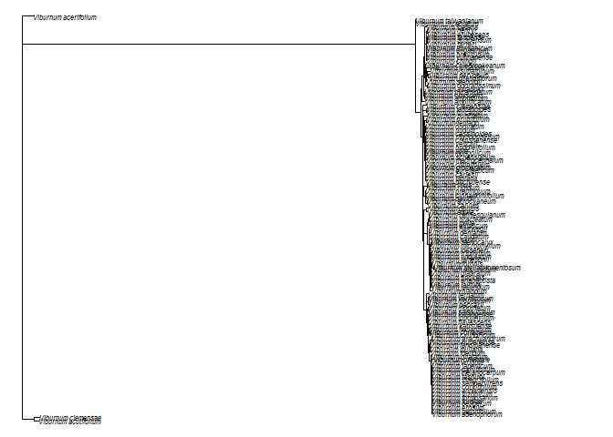
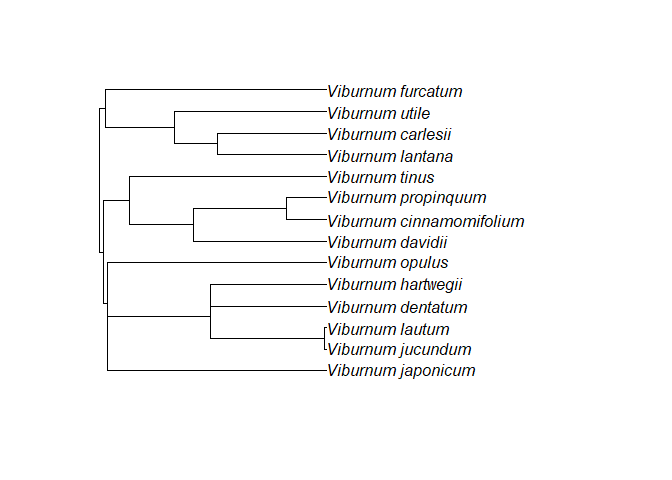
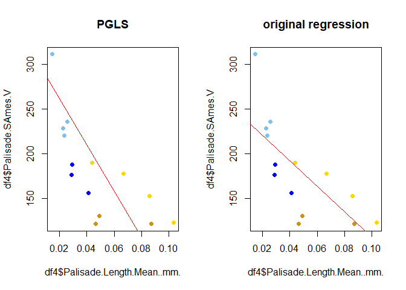
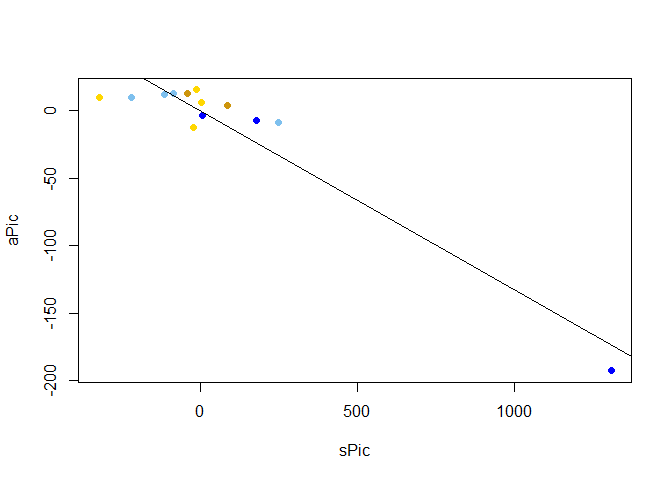

A phylogenetic approach to palisade cell functional trait analysis in
Viburnum
================
Aleca Borsuk
11/30/2020

## Maximum Likelihood

Maximum likelihood tree for subset of Viburnum taxa constructed using
chloroplast sequence data from NCBI and IQTree:

``` r
# read in the phylogeny generated by IQtree 
phy = read.tree("concatenated.fasta.treefile")

# resolve multichotomies into a series of dichotomies with one (or more) branches of length zero
phy=multi2di(phy)

#root the phylogeny with V. clemensiae, sister to rest of genus
root(phy, phy[[4]][94])
```

    ## 
    ## Phylogenetic tree with 119 tips and 118 internal nodes.
    ## 
    ## Tip labels:
    ##   Viburnum_acerifolium, Viburnum_acutifolium, Viburnum_clemensae, Viburnum_adenophorum, Viburnum_betulifolium, Viburnum_erosum, ...
    ## 
    ## Rooted; includes branch lengths.

``` r
#check if rooted
is.rooted(phy) 
```

    ## [1] TRUE

``` r
#View the phylogeny
plot(phy, no.margin=TRUE,edge.width=1, cex = 0.5)
```

<!-- -->

``` r
# Make ultrameric phylogeny (relative to root depth = 1)
phy_calibration <- makeChronosCalib(phy, node = "root", age.min = 1, age.max =
1, interactive = FALSE, soft.bounds = FALSE)

#make the phylogeny ultrameric using relative calibration
phy_ultrameric <- chronos(phy, lambda = 1, model = "correlated", calibration = phy_calibration, control = chronos.control() )
```

    ## 
    ## Setting initial dates...
    ## Fitting in progress... get a first set of estimates
    ##          (Penalised) log-lik = -50.90982 
    ## Optimising rates... dates... -50.90982 
    ## Optimising rates... dates... -6.67637 
    ## Optimising rates... dates... -2.489876 
    ## Optimising rates... dates... -2.263107 
    ## Optimising rates... dates... -2.123351 
    ## Optimising rates... dates... -2.015709 
    ## Optimising rates... dates... -1.983454 
    ## Optimising rates... dates... -1.982822

    ## Warning: false convergence (8)

    ## 
    ## log-Lik = -1e+100 
    ## PHIIC = 2e+100

``` r
class( phy_ultrameric ) = "phylo"

#View the ultrameric phylogeny
plot(phy_ultrameric, no.margin=TRUE,edge.width=1, cex = 0.5)
```

<!-- --> \#\#
Pruning the Tree to Species of Interest

``` r
# Read in species names of interest for comparative analysis. This is also the table with trait data
# Trait data is a combination of measured and dummy data (study in progress)
df <- read.csv("PalisadeTraits.csv", header = TRUE)

# Remove the species of interest from the list of species to drop, then drop tips
sp_keep <- df$Species
sp_full <- phy[[4]]
to.drop <- sp_full [! sp_full %in% sp_keep]

phy_reduced = drop.tip( phy_ultrameric, to.drop )

plot( phy_reduced )
```

<!-- -->

## Mapping Character Data onto the Tree

Visualization of the character ‘palisade.type’ mapped onto the tree
tips.

``` r
# View data in table format
kable(df)
```

| Species                   | PalisadeType |      Amax | Native.Habitat  | Leaf.Thickness.Mean..mm. | Palisade.SAmes.V | Palisade.Mesophyll.Thickness.Mean..mm. | Palisade.Length.Mean..mm. | Palisade.Cell.Packing.Density….mm2. | Stomatal.Density….mm2. |
| :------------------------ | :----------- | --------: | :-------------- | -----------------------: | ---------------: | -------------------------------------: | ------------------------: | ----------------------------------: | ---------------------: |
| Viburnum\_jucundum        | H1           |  7.313572 | cloud\_forest   |                 0.120570 |         228.0162 |                                0.02275 |                   0.02275 |                            1520.087 |              134.91863 |
| Viburnum\_dentatum        | H1           |  9.931000 | cold\_temperate |                 0.120000 |         235.7622 |                                0.02564 |                   0.02564 |                            1857.143 |               98.76543 |
| Viburnum\_furcatum        | H1           |  7.265848 | cold\_temperate |                 0.090370 |         310.8701 |                                0.01475 |                   0.01475 |                            1973.387 |              171.64782 |
| Viburnum\_opulus          | H1           |  7.772967 | cold\_temperate |                 0.102160 |         220.3936 |                                0.02338 |                   0.02338 |                            1369.464 |              103.80623 |
| Viburnum\_hartwegii       | H2           | 12.391639 | cloud\_forest   |                 0.157000 |         176.3421 |                                0.05434 |                   0.02878 |                             945.520 |               95.74468 |
| Viburnum\_lautum          | H2           | 13.222929 | cloud\_forest   |                 0.170090 |         187.9587 |                                0.04976 |                   0.02914 |                            1314.245 |              102.93008 |
| Viburnum\_japonicum       | H2           | 16.201844 | warm\_temperate |                 0.267772 |         156.0678 |                                0.08221 |                   0.04117 |                            2967.359 |              503.16860 |
| Viburnum\_carlesii        | I1           | 10.325898 | cold\_temperate |                 0.187990 |         189.9813 |                                0.04360 |                   0.04360 |                            3518.030 |              126.95312 |
| Viburnum\_lantana         | I1           | 14.099067 | cold\_temperate |                 0.178980 |         177.6062 |                                0.06651 |                   0.06651 |                            4423.963 |              163.73921 |
| Viburnum\_tinus           | I1           | 12.258578 | cold\_temperate |                 0.317000 |         123.0385 |                                0.10339 |                   0.10339 |                            2693.089 |              155.55556 |
| Viburnum\_utile           | I1           | 10.777627 | cold\_temperate |                 0.241000 |         152.6536 |                                0.08579 |                   0.08579 |                            4928.989 |              255.00000 |
| Viburnum\_cinnamomifolium | I2           | 10.763419 | warm\_temperate |                 0.228000 |         121.5397 |                                0.09027 |                   0.04646 |                            2422.145 |              437.50000 |
| Viburnum\_davidii         | I2           | 18.228239 | warm\_temperate |                 0.364060 |         121.5932 |                                0.16325 |                   0.08694 |                            2416.626 |              423.13117 |
| Viburnum\_propinquum      | I2           | 15.506569 | warm\_temperate |                 0.227020 |         130.6503 |                                0.08139 |                   0.04905 |                            2421.652 |              279.22561 |

``` r
# Plot tree with tip labels by palisade type
cols <- c("skyblue2","blue","gold","darkgoldenrod3")

palisade.type_plot = ggtree(phy_reduced) %<+% df + 
  geom_tiplab( fontface = "italic", offset = 0.005) +
  scale_color_manual(values=cols) + 
  xlim(0, 1) +
  theme_tree2(legend.position='right')+
  geom_tippoint( aes(color=PalisadeType), size=3, alpha=1 )

palisade.type_plot
```

<!-- -->

## Phylogenetically Informed ANOVA

Here using the tree from the above analysis to do a test run of a
phylogenetically informed ANOVA. ANOVA method conducted using geiger
v2.0 (Pennell et al. 2014):

``` r
# Data formatting
# format discrete data as factor
df$PalisadeType <- as.factor(df$PalisadeType)
# anova function takes named vectors as input
df1= df[,2]
df2 = df[,3]
names(df1)=df[,1]
names(df2)=df[,1]

# run ANOVA
x1=aov.phylo(df2~df1, phy_reduced, nsim=10000)
```

    ## Analysis of Variance Table
    ## 
    ## Response: dat
    ##           Df Sum-Sq Mean-Sq F-value   Pr(>F) Pr(>F) given phy  
    ## group      3 96.907  32.302  6.4555 0.010484          0.05299 .
    ## Residuals 10 50.038   5.004                                    
    ## ---
    ## Signif. codes:  0 '***' 0.001 '**' 0.01 '*' 0.05 '.' 0.1 ' ' 1

``` r
# formatted summary table
kable(attributes(x1)$summary)
```

|           | Df |   Sum-Sq |   Mean-Sq |  F-value |   Pr(\>F) | Pr(\>F) given phy |
| :-------- | -: | -------: | --------: | -------: | --------: | ----------------: |
| group     |  3 | 96.90668 | 32.302226 | 6.455547 | 0.0104837 |         0.0529947 |
| Residuals | 10 | 50.03794 |  5.003794 |       NA |        NA |                NA |

``` r
# boxplot visualization
plot(df$Amax~df$PalisadeType, col=cols)
```

<!-- --> The
p-value for the ANOVA is significant before and insignificant after
accounting for phylogenetic signal, indicating that photosynthetic rate
is not related to palisade type after accounting for phylogenetic
signal.

``` r
# ANOVA again with palisade type as a predictor of palisade mesophyll thickness

# anova function takes named vectors as input
df1= df[,2]
df3 = df[,7]
names(df1)=df[,1]
names(df3)=df[,1]

# run ANOVA
x2=aov.phylo(df3~df1, phy_reduced, nsim=10000)
```

    ## Analysis of Variance Table
    ## 
    ## Response: dat
    ##           Df    Sum-Sq   Mean-Sq F-value    Pr(>F) Pr(>F) given phy  
    ## group      3 0.0144592 0.0048197  7.1933 0.0073912           0.0411 *
    ## Residuals 10 0.0067003 0.0006700                                     
    ## ---
    ## Signif. codes:  0 '***' 0.001 '**' 0.01 '*' 0.05 '.' 0.1 ' ' 1

``` r
# formatted summary table
kable(attributes(x2)$summary)
```

|           | Df |    Sum-Sq |   Mean-Sq |  F-value |   Pr(\>F) | Pr(\>F) given phy |
| :-------- | -: | --------: | --------: | -------: | --------: | ----------------: |
| group     |  3 | 0.0144592 | 0.0048197 | 7.193327 | 0.0073912 |         0.0410959 |
| Residuals | 10 | 0.0067003 | 0.0006700 |       NA |        NA |                NA |

``` r
# boxplot visualization
plot(df$Palisade.Mesophyll.Thickness.Mean..mm.~df$PalisadeType, col=cols)
```

<!-- -->

The p-value for the ANOVA is significant before and after accounting for
phylogenetic signal, indicating that palisade thickness is related to
palisade type after accounting for phylogenetic signal.

## Phylognetic Independent Contrasts

``` r
# Relationship between palisade surface area to volume ratio (Palisade.SAmes.V) and palisade cell length (Palisade.Length.Mean..mm.)

# Extract columns
sav.mes<-df[,"Palisade.SAmes.V"]
palisade.length<-df[,"Palisade.Length.Mean..mm."]

# Give them names
names(sav.mes)<-names(palisade.length)<-df$Species

# Calculate PICs
aPic<-pic(sav.mes, phy_reduced)
lPic<-pic(palisade.length, phy_reduced)

# Make a model
picModel<-lm(aPic~lPic-1)

# Yes, significant
summary(picModel)
```

    ## 
    ## Call:
    ## lm(formula = aPic ~ lPic - 1)
    ## 
    ## Residuals:
    ##     Min      1Q  Median      3Q     Max 
    ## -317.18 -170.24  -16.19  149.99  681.22 
    ## 
    ## Coefficients:
    ##      Estimate Std. Error t value Pr(>|t|)   
    ## lPic  -3002.3      763.7  -3.931  0.00199 **
    ## ---
    ## Signif. codes:  0 '***' 0.001 '**' 0.01 '*' 0.05 '.' 0.1 ' ' 1
    ## 
    ## Residual standard error: 268.9 on 12 degrees of freedom
    ## Multiple R-squared:  0.5629, Adjusted R-squared:  0.5265 
    ## F-statistic: 15.46 on 1 and 12 DF,  p-value: 0.001994

``` r
# plot results
plot(aPic~lPic, pch = 19, col=as.factor(df$PalisadeType))+
abline(a=0, b=coef(picModel))
```

<!-- -->

    ## integer(0)

``` r
# Relationship between SAV and photosynthetic rate

# Extract columns
amax<-df[,"Amax"]
sav<-df[,"Palisade.SAmes.V"]

# Give them names
names(amax)<-names(sav)<-df$Species

# Calculate PICs
aPic<-pic(amax, phy_reduced)
sPic<-pic(sav, phy_reduced)

# Make a model
picModel<-lm(aPic~sPic-1)

# Yes, significant
summary(picModel)
```

    ## 
    ## Call:
    ## lm(formula = aPic ~ sPic - 1)
    ## 
    ## Residuals:
    ##     Min      1Q  Median      3Q     Max 
    ## -32.845 -15.902   1.796  13.717  24.396 
    ## 
    ## Coefficients:
    ##      Estimate Std. Error t value Pr(>|t|)    
    ## sPic  -0.1328     0.0121  -10.97 1.31e-07 ***
    ## ---
    ## Signif. codes:  0 '***' 0.001 '**' 0.01 '*' 0.05 '.' 0.1 ' ' 1
    ## 
    ## Residual standard error: 17.05 on 12 degrees of freedom
    ## Multiple R-squared:  0.9093, Adjusted R-squared:  0.9017 
    ## F-statistic: 120.3 on 1 and 12 DF,  p-value: 1.309e-07

``` r
# plot results
plot(aPic~sPic, pch = 19, col=as.factor(df$PalisadeType))+
abline(a=0, b=coef(picModel))
```

<!-- -->

    ## integer(0)

``` r
# Using phylogenetic generalized least squares (PGLS) to control for potential phylogenetic signal in the response (and, hence, non-independence of the residuals). This helps us understand if trait relationships are driven by ancestry rather than selection.

# Get data and set species to row names. Also need column with species names
df.temp <- read.csv("PalisadeTraits.csv")
df4 <- read.csv("PalisadeTraits.csv", row.names=1)
df4$Species <- df.temp$Species

# Use Geiger to check if names match
name.check(phy_reduced, df4)
```

    ## [1] "OK"

``` r
# Variables = photosynthetic rate and surface area to volume ratio

# Run pgls model 
pglsModel<-gls(Amax~Palisade.SAmes.V, correlation=corBrownian(phy=phy_reduced, form = ~Species), data=df4, method="ML")
coef(pglsModel)
```

    ##      (Intercept) Palisade.SAmes.V 
    ##       36.2826065       -0.1327499

``` r
summary(pglsModel)
```

    ## Generalized least squares fit by maximum likelihood
    ##   Model: Amax ~ Palisade.SAmes.V 
    ##   Data: df4 
    ##        AIC      BIC    logLik
    ##   86.39201 88.30918 -40.19601
    ## 
    ## Correlation Structure: corBrownian
    ##  Formula: ~Species 
    ##  Parameter estimate(s):
    ## numeric(0)
    ## 
    ## Coefficients:
    ##                     Value Std.Error   t-value p-value
    ## (Intercept)      36.28261 3.0961139  11.71876       0
    ## Palisade.SAmes.V -0.13275 0.0121038 -10.96760       0
    ## 
    ##  Correlation: 
    ##                  (Intr)
    ## Palisade.SAmes.V -0.725
    ## 
    ## Standardized residuals:
    ##         Min          Q1         Med          Q3         Max 
    ## -1.72261048 -0.56027658  0.01428389  0.25151644  2.24874695 
    ## 
    ## Residual standard error: 5.448014 
    ## Degrees of freedom: 14 total; 12 residual

``` r
palette( c("skyblue2","blue","gold","darkgoldenrod3"))

# Plot and compare with a linear model without phylogenetic correction
layout(t(1:2))
plot(df4$Amax~df4$Palisade.SAmes.V, pch = 19, col=as.factor(df4$PalisadeType))+
abline(a=coef(pglsModel)[1], b=coef(pglsModel)[2], col = "red")
```

    ## integer(0)

``` r
title("PGLS")

plot(df4$Amax~df4$Palisade.SAmes.V, pch = 19, col=as.factor(df4$PalisadeType))+
abline(lm(df4$Amax~df4$Palisade.SAmes.V), col = "red")
```

    ## integer(0)

``` r
title("original regression")
```

<!-- -->

``` r
# Using phylogenetic generalized least squares (PGLS) to control for potential phylogenetic signal in the response (and, hence, non-independence of the residuals). This helps us understand if trait relationships are driven by ancestry rather than selection.

# New variables = surface area to volume ratio and palisade cell length

# Run pgls model 
pglsModel<-gls(Palisade.SAmes.V~Palisade.Length.Mean..mm., correlation=corBrownian(phy=phy_reduced, form = ~Species), data=df4, method="ML")
coef(pglsModel)
```

    ##               (Intercept) Palisade.Length.Mean..mm. 
    ##                  330.9951                -3002.3189

``` r
summary(pglsModel)
```

    ## Generalized least squares fit by maximum likelihood
    ##   Model: Palisade.SAmes.V ~ Palisade.Length.Mean..mm. 
    ##   Data: df4 
    ##        AIC      BIC    logLik
    ##   163.6145 165.5317 -78.80725
    ## 
    ## Correlation Structure: corBrownian
    ##  Formula: ~Species 
    ##  Parameter estimate(s):
    ## numeric(0)
    ## 
    ## Coefficients:
    ##                                Value Std.Error   t-value p-value
    ## (Intercept)                 330.9951   50.0304  6.615876   0.000
    ## Palisade.Length.Mean..mm. -3002.3189  763.6805 -3.931381   0.002
    ## 
    ##  Correlation: 
    ##                           (Intr)
    ## Palisade.Length.Mean..mm. -0.74 
    ## 
    ## Standardized residuals:
    ##        Min         Q1        Med         Q3        Max 
    ## -0.8145137 -0.6128123 -0.3080845  0.4745131  1.1926858 
    ## 
    ## Residual standard error: 85.90117 
    ## Degrees of freedom: 14 total; 12 residual

``` r
# Plot and compare with a linear model without phylogenetic correction
layout(t(1:2))
plot(df4$Palisade.SAmes.V ~df4$Palisade.Length.Mean..mm., pch = 19, col=as.factor(df4$PalisadeType))+
abline(a=coef(pglsModel)[1], b=coef(pglsModel)[2], col = "red")
```

    ## integer(0)

``` r
title("PGLS")

plot(df4$Palisade.SAmes.V ~df4$Palisade.Length.Mean..mm., pch = 19, col=as.factor(df4$PalisadeType))+
abline(lm(df4$Palisade.SAmes.V ~df4$Palisade.Length.Mean..mm.), col = "red")
```

    ## integer(0)

``` r
title("original regression")
```

<!-- -->
