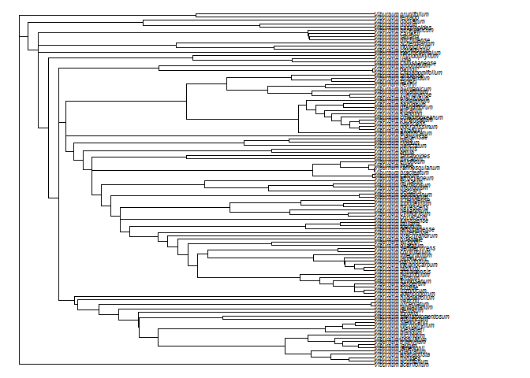

# Phylogenetic Biology - Final Project

## Guidelines - you can delete this section before submission

This repository is a stub for your final project. Fork it, develop your project, and submit it as a pull request. Edit/ delete the text in this readme as needed.

Some guidelines and tips:

- Use the stubs below to write up your final project. Alternatively, if you would like the writeup to be an executable document (with [knitr](http://yihui.name/knitr/), [jupytr](http://jupyter.org/), or other tools), you can create it as a separate file and put a link to it here in the readme.

- For information on formatting text files with markdown, see https://guides.github.com/features/mastering-markdown/ . You can use markdown to include images in this document by linking to files in the repository, eg ``.

- The project must be entirely reproducible. In addition to the results, the repository must include all the data (or links to data) and code needed to reproduce the results.

- If you are working with unpublished data that you would prefer not to publicly share at this time, please contact me to discuss options. In most cases, the data can be anonymized in a way that putting them in a public repo does not compromise your other goals.

- Paste references (including urls) into the reference section, and cite them with the general format (Smith at al. 2003).

- Commit and push often as you work.

OK, here we go.

# A phylogenetic approach to palisade cell functional trait analysis in Viburnum

## Introduction and Goals

Once light enters the leaf, to reach a chloroplast it must traverse a complex landscape of different cell types, each with various implications for light transport (Vogelmann 1993). The sunlit upper layer of a typical leaf has one or more layers of photosynthetic cells called the palisade mesophyll. Palisade cells are usually cylindrically shaped and oriented perpendicular to the leaf surface. It is thought that the elongated geometry and close-packing of these cells aids in light propagation into the leaf and provides a high surface area to volume ratio that facilitates the absorption of carbon dioxide (Ho et al. 2016). An alternative palisade morphology has been observed in the genus *Viburnum*, consisting of branched cells that form an H-shape in cross-sectional profile. The phylogenetic relationships between “H-cells” and the typical “I-cells”  were characterized by Chatelet et al. (2013) for several species from the *Viburnum* clade. Chatelet et al. (2013) found that the H-cell morphology was ancestral, and that multiple evolutionary transitions have occurred from single layers of H-cells to double layers of H-cells or to I-cells, likely as species moved from understory or cloudy environments to more open environments. As suggested by Chatelet et al. (2013), the different palisade cells morphologies could thus be adaptations to different light environments, where the H-cells aid in light interception and propagation in diffuse light environments, while double layers of H-cells and the I-cells aid in light interception and propagation in direct light environments. The goal of my project is to use a phylogenetically informed approach to testing the functional implications of leaf tissue optics on the photosynthetic performance of *Viburnum* species with H- and I- palisade cell types. Specifically, I aim to:

1.	Reproduce a time-calibrated phylogeny for the *Viburnum* species reported in Chatelet et al. (2013). This will be a collaborative effort with Josh Randall who is also interested in palisade morphology in *Viburnum* and will be undertaking a complementary project in comparative analyses of evolution rates. 
2.	Produce a time-calibrated phylogeny for the subset of *Viburnum* species that I have collected my own physiological data for; this will serve as a visualization tool and as a sensitivity analysis for the effect of sample size on producing the anticipated evolutionary relationships. This will also help me assess whether my sampling has been sufficient to capture phylogenetically independent replicates for each palisade type (H1, H2, I1, I2).
3.	Test for correlated evolution between pairs of continuous physiological traits using the phylogenetic least squares regression and/or independent contrasts method(s),which can be implemented in the R package ape (Paradis & Schliep 2019). 
4.	Test for correlated evolution between discrete (palisade cell type) and continuous physiological traits using a phylogenetic ANOVA or MANOVA, which can be implemented in the R package geiger (Pennell 2014).

These workflows will not only help me with my current project, but hopefully be transferable to projects I work on in the future.

## Methods

The tools I used were... See .md file for now, will update this page for final submission. 

## Results

The tree in Figure 1...

## Discussion

These results indicate...

The biggest difficulty in implementing these analyses was...

If I did these analyses again, I would...

## References

