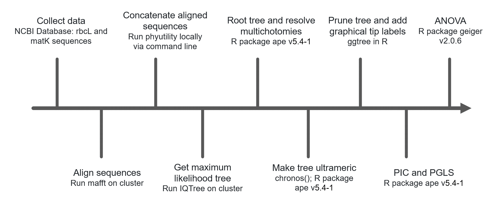
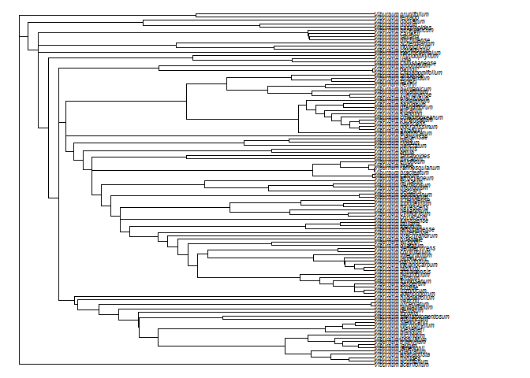

# Phylogenetic Biology - Final Project
# A phylogenetic approach to palisade cell functional trait analysis in *Viburnum*

## Introduction and Goals

Once light enters the leaf, to reach a chloroplast it must traverse a complex landscape of different cell types, each with various implications for light transport (Vogelmann 1993). The sunlit upper layer of a typical leaf has one or more layers of photosynthetic cells called the palisade mesophyll. Palisade cells are usually cylindrically shaped and oriented perpendicular to the leaf surface. It is thought that the elongated geometry and close-packing of these cells aids in light propagation into the leaf and provides a high surface area to volume ratio that facilitates the absorption of carbon dioxide (Ho et al. 2016). An alternative palisade morphology has been observed in the genus *Viburnum*, consisting of branched cells that form an H-shape in cross-sectional profile. 

Representative cartoon (green) and 3D-image renderings (blue) of I- and H-cell morphology: 

The phylogenetic relationships between “H-cells” and the typical “I-cells”  were characterized by Chatelet et al. (2013) for several species from the *Viburnum* clade. Chatelet et al. (2013) found that the H-cell morphology was ancestral, and that multiple evolutionary transitions have occurred from single layers of H-cells to double layers of H-cells or to I-cells, likely as species moved from understory or cloudy environments to more open environments. As suggested by Chatelet et al. (2013), the different palisade cells morphologies could thus be adaptations to different light environments, where the H-cells aid in light interception and propagation in diffuse light environments, while double layers of H-cells and the I-cells aid in light interception and propagation in direct light environments. The goal of my project is to use a phylogenetically informed approach to testing the functional implications of leaf tissue optics on the photosynthetic performance of *Viburnum* species with H- and I- palisade cell types. Specifically, I aim to:

1.	Produce an ultrameric phylogeny with broad representation of the *Viburnum* clade. This will be a collaborative effort with Josh Randall who is also interested in palisade morphology in *Viburnum* and will be undertaking a complementary project in comparative analyses of evolution rates. 
2.	Prune the ultrameric phylogeny to a subset of Viburnum species that I plan to include in the current study. This will serve as a visualization tool and as a sensitivity analysis for the effect of sample size on producing the anticipated evolutionary relationships. This will also help me assess whether my sampling has been sufficient to capture phylogenetically independent replicates for each palisade type (H1, H2, I1, I2).
3.	Test for correlated evolution between pairs of continuous physiological traits using the phylogenetic least squares regression and independent contrasts method(s),which can be implemented in the R (R Core Team 2013) package ape (version 5.4.1; Paradis & Schliep 2019). 
4.	Test for correlated evolution between discrete (palisade cell type) and continuous physiological traits using a phylogenetic ANOVA, which can be implemented in the R (R Core Team 3013) package geiger (Pennell 2014).

These workflows will not only help me with my current project, but hopefully be transferable to projects I work on in the future.  

## Methods

Publicly available gene sequence data were collected from the database resources of the National Center for Biotechnology Information (NCBI Resource Coordinators 2016). Sequences were obtained from the matK and rbcL chloroplast genes representing 119 taxa in total. Sequences for each gene were aligned using the multiple sequence alignment program MAFFT (version 7; Katoh 2002) on the Yale Center for Research Computing (YCRC) cluster. The alinged sequences were concatenated using the Phyutility command line phyloinformatics program (version 2.7.1; Smith and Dunn 2008). Phylogenetic inference using maximum likelihood was implemented in IQ-tree (version 1.6.12; Nguyen et al. 2015) on the YCRC cluster. The multi2di() function from the ape (version 5.4.1; Paradis & Schliep 2019) package for R (R Core Team 2013) was used to randomly resolve multichotomies into a series of dichotomies with one or more branches of length zero. The tree was rooted using the root() function in ape (version 5.4.1; Paradis & Schliep 2019) with *V. clemensiae* as the outgroup, which has been reported as sister to the rest of the genus (Chatelet et al. 2013). The tree was made ultrameric using the chronos() function in ape (version 5.4.1; Paradis & Schliep 2019), with lambda = 1 and using a correlated model. The tree was then pruned to the species of interest for my current study using the drop.tip() function in from the ape (version 5.4.1; Paradis & Schliep 2019) package in R (R Core Team 2013). The resulting tree was used to conduct phylogenetically informed statistical explorations of palisade cell functional traits. ANOVA, phylogenetic independent contrasts, and phylogenetic least squares regressions were conducted using the ape (version 5.4.1; Paradis & Schliep 2019) package in R (R Core Team 2013).

A summary of the overall workflow is as follows:  

## Results

**Phylogenetic inference**
The best-fit model according to the Bayesian information criterion (BIC) was HKY+F+R3 with a log-likelihood of -8486.2452. The reconstructed tree for 119 species is shown below.

**Comparative methods**

## Discussion

These results indicate...

The biggest difficulty in implementing these analyses was...

If I did these analyses again, I would...

## References

Vogelmann, T.C. and Martin, G., 1993. The functional significance of palisade tissue: penetration of directional versus diffuse light. Plant, Cell & Environment, 16(1), pp.65-72.

Ho, Q.T., Berghuijs, H.N., Watté, R., Verboven, P., Herremans, E., Yin, X., Retta, M.A., Aernouts, B., Saeys, W., Helfen, L. and Farquhar, G.D., 2016. Three‐dimensional microscale modelling of CO2 transport and light propagation in tomato leaves enlightens photosynthesis. Plant, cell & environment, 39(1), pp.50-61.

Chatelet, D.S., Clement, W.L., Sack, L., Donoghue, M.J. and Edwards, E.J., 2013. The evolution of photosynthetic anatomy in Viburnum (Adoxaceae). International Journal of Plant Sciences, 174(9), pp.1277-1291.

R Core Team, 2013. R: A language and environment for statistical computing.

Paradis E, Schliep K (2019). “ape 5.0: an environment for modern phylogenetics and evolutionary analyses in R.” Bioinformatics, 35, 526-528.

Pennell M, Eastman J, Slater G, Brown J, Uyeda J, Fitzjohn R, Alfaro M, Harmon L (2014). “geiger v2.0: an expanded suite of methods for fitting macroevolutionary models to phylogenetic trees.” Bioinformatics, 30, 2216-2218.

NCBI Resource Coordinators (2016). Database resources of the National Center for Biotechnology Information. Nucleic acids research, 44(D1), D7–D19. https://doi.org/10.1093/nar/gkv1290

Katoh,K., Misawa,K., Kuma,K., and Miyata,T. (2002) MAFFT: a novel method for rapid multiple sequence alignment based on fast Fourier transform. Nucleic Acid Res., 30:3059-3066

Smith, S. A. and Dunn, C. W. (2008) Phyutility: a phyloinformatics tool for trees, alignments, and molecular data. Bioinformatics. 24: 715-716

Nguyen, L.T., Schmidt, H.A., Von Haeseler, A. and Minh, B.Q., 2015. IQ-TREE: a fast and effective stochastic algorithm for estimating maximum-likelihood phylogenies. Molecular biology and evolution, 32(1), pp.268-274.

